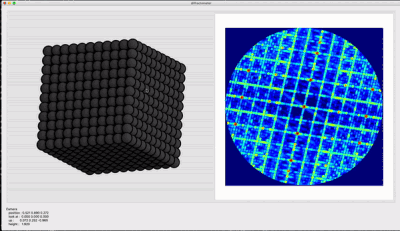

# GIXStapose
GIXStapose is a new interactive analysis tool for for studying semi-crystalline and soft materials structures. It enables grazing incidence X-ray scattering (GIXS) patterns to be visualized while interactively rotating chemical structures, especially periodic simulation volumes generated from molecular simulations.

This functionality is useful for interactively identifying  real-space chemical features that correspond to bright diffraction peaks and the rotation matrices that generate them.
As such, this tool has potential to aid in the [reproducible generation of figures that include both GIXS and structural data](http://dx.doi.org/10.1080/08927022.2017.1296958), and it has pedagogical potential for students learning about crystal structures and diffraction.

GIXStapose is made possible by open-source packages, including the high-quality rendering of the [Fresnel ray-tracer](https://fresnel.readthedocs.io/en/stable/), the ability to read in multiple chemical file formats of [MBuild](https://mosdef.org/mbuild/index.html), and numpy's fast Fourier implementations used in [interactive diffraction analysis](https://bitbucket.org/cmelab/cme_utils/src/master/cme_utils/analyze/diffractometer.py), and by funding from the National Science Foundation (#1835593)



To install:
1. Create environment and install necessary packages
```
conda create -y -n GIXStapose -c conda-forge -c omnia -c mosdef python=3.7 pillow numpy matplotlib mbuild fresnel pyside2 freud py3dmol openbabel
```
2. Clone and install the cme_utils package
```
git clone git@bitbucket.org:cmelab/cme_utils.git
cd cme_utils
pip install .
```

To run a simple cubic example:
```
python gixstapose/main.py
```
to load an input file format supported by [MDTraj](http://mdtraj.org/1.8.0/load_functions.html) (e.g., pdb, xml, dcd, xyz, hoomdxml) or a [gsd file](https://gsd.readthedocs.io/en/stable/):
```
python gixstapose/main.py -i INPUTFILE
```

